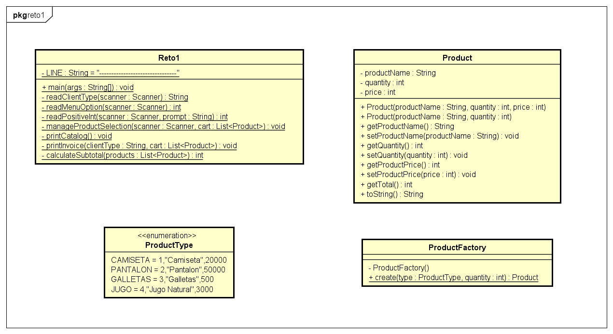
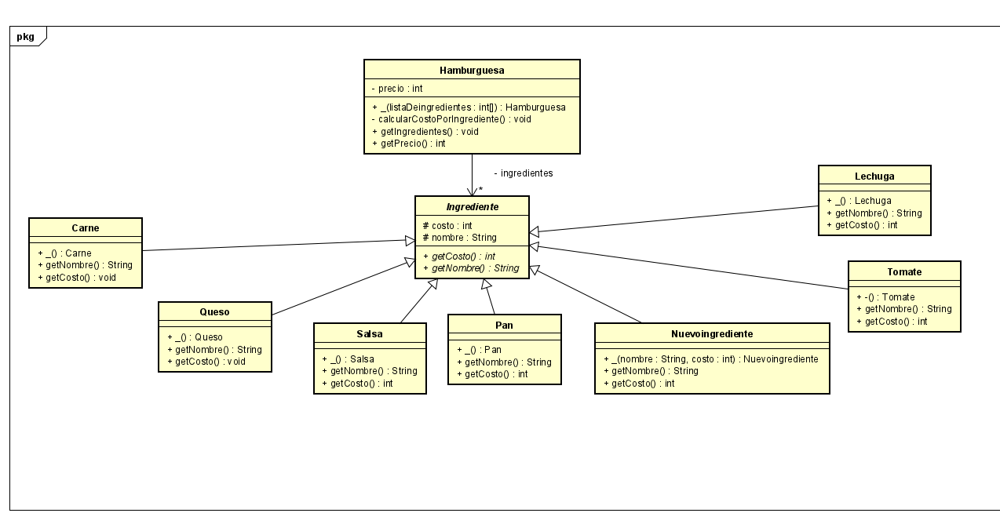
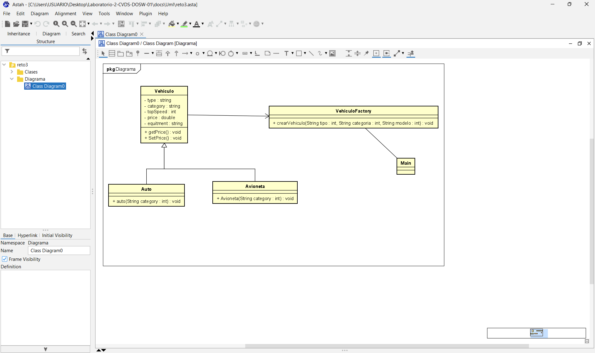
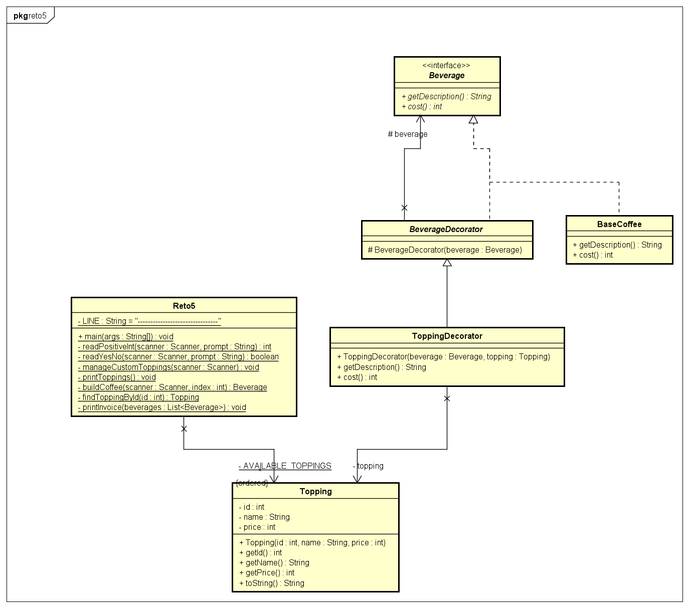
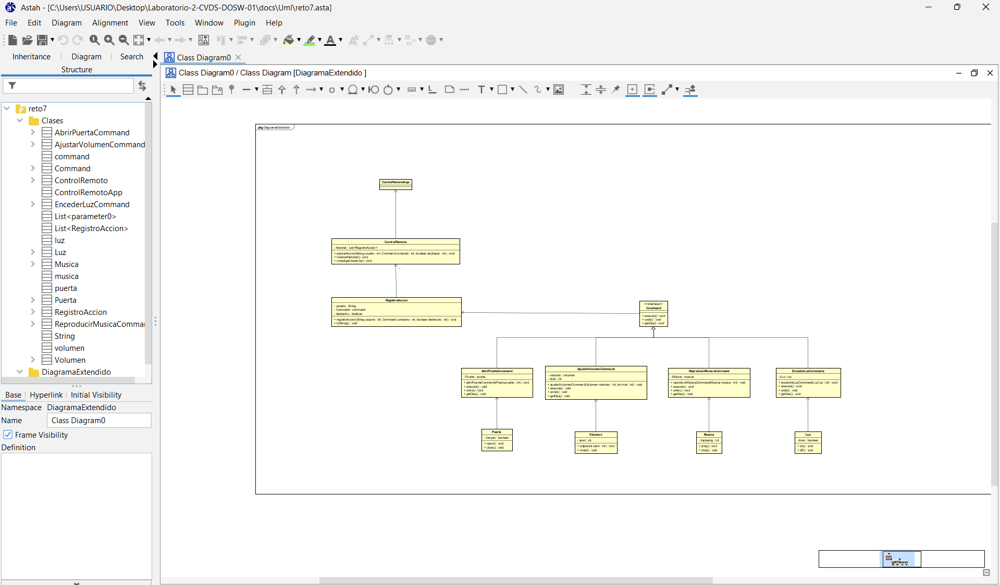
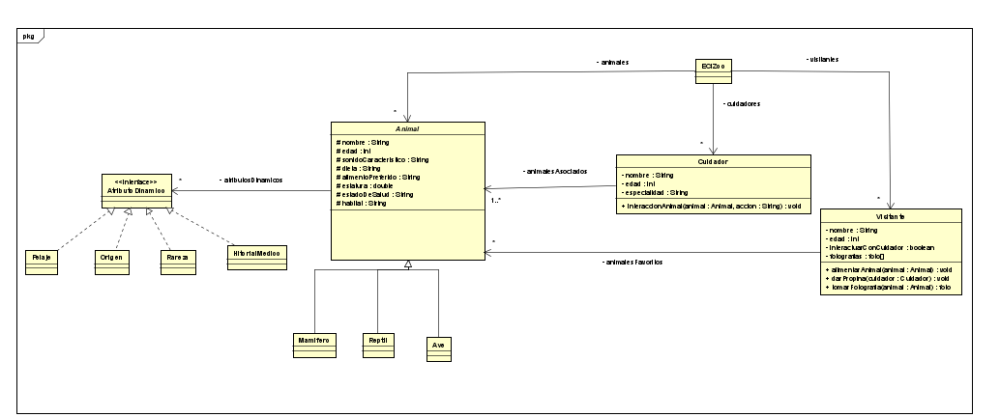

# Laboratorio 2 - CVDS (DOSW)

Este repositorio contiene el código fuente y los recursos del Laboratorio 2 para la asignatura CVDS (Diseño Orientado a Software) en el curso DOSW.

## Resumen

Proyecto de ejemplo orientado a patrones de diseño y buenas prácticas en Java. Contiene paquetes organizados por categorías (comportamentales, creacionales, estructurales, SOLID) y utilidades.

## Contenido principal

- `src/main/java/edu/dosw/lab/` - Código fuente Java del laboratorio.
- `docs/uml/` - Diagramas UML usados en el laboratorio.
- `docs/imagenes/` - Imágenes y recursos gráficos.
- `HELP.md` - Notas y descubrimientos importantes durante la construcción del proyecto.

## Nota importante del proyecto

El archivo `HELP.md` contiene una observación relevante: el nombre de paquete original `edu.dosw.lab.Laboratorio-2-CVDS-DOSW-01` es inválido en Java y en este repositorio se usa `edu.dosw.lab.Laboratorio_2_CVDS_DOSW_01` (con guiones bajos). Si vas a cambiar el paquete padre o el POM, revisa esa modificación para evitar conflictos.

## Requisitos

- Java JDK 11+ (o la versión que indique el POM del proyecto)
- Apache Maven 3.6+
- IDE recomendado: IntelliJ IDEA / Eclipse / VS Code con extensiones Java

## Comandos útiles (PowerShell)

Compilar y empaquetar el proyecto:

```powershell
mvn clean package
```

Ejecutar pruebas unitarias:

```powershell
mvn test
```

Actualizar dependencias y verificar el árbol de dependencias:

```powershell
mvn dependency:tree
```

Si el proyecto requiere generar una imagen OCI (Spring Boot con plugin de build-image):

```powershell
mvn spring-boot:build-image
```

> Observación: los comandos asumen que Maven y Java están instalados y accesibles desde PowerShell.

## Estructura del paquete

El código está organizado por paquetes bajo `edu.dosw.lab` y subdividido en carpetas según el tipo de patrón o contenido:

- `comportamentales/` - Implementaciones de patrones comportamentales.
- `creacionales/` - Implementaciones de patrones creacionales.
- `estructurales/` - Implementaciones de patrones estructurales.
- `solid/` - Ejemplos relacionados con principios SOLID.
- `util/` - Clases utilitarias compartidas.

## Cómo contribuir

1. Crea una rama nueva con un nombre descriptivo.
2. Realiza cambios y añade pruebas cuando corresponda.
3. Abre un Pull Request describiendo los cambios y su motivación.

## Notas sobre POM y herencia

El `HELP.md` menciona que el POM del proyecto anuló elementos heredados del POM padre (por ejemplo, `<license>` y `<developers>`) mediante sobreescrituras vacías para evitar heredar contenido no deseado. Si cambias el POM padre y deseas heredar esos elementos, elimina las anulaciones vacías en el POM del proyecto.

## Recursos y documentación

- Documentación de Maven: https://maven.apache.org/guides/index.html
- Plugin Maven de Spring Boot: https://docs.spring.io/spring-boot

## Licencia

Incluye o actualiza la licencia según las políticas del curso o de tu organización. Si no hay una licencia definida, asume que el repositorio es para uso académico privado.

## Contacto

Para dudas relacionadas con el laboratorio, contacta al profesor o al equipo de curso; para cuestiones del código, abre un issue en el repositorio.

---

Archivo generado automáticamente a partir del contenido del repositorio y `HELP.md`.

----
## RETOS
## Reto #1: El problema de la tienda de Don Pepe
Don Pepe es el dueño de una tienda, pero cada fin de mes siempre se encuentra con que sus cuentas no cuadran. Su problema principal es que la forma en que vende sus productos y calcula los descuentos no está organizada, y eso le genera pérdidas y confusión.

### Diseño UML

### Patrón de Diseño
Creacional - Factory

### Justificación

Se hizo uso de este Patrón de Diseño para la creación de los items vendidos en la tienda

## Reto #2
### Diseño UML

### Patrón de Diseño
Creacional

### Patrón Utilizado

Factory Method

### Justificación

Hamburguesa crea un objeto dependiendo de las elecciones de usuario (Pan, Carne, Queso,...), por lo que Hamburguesa está funcionando como una Factory.
## reto #3
## Diseño UML


### Explicacion del punto
- Contenía atributos comunes como marca, modelo, año.
- Tenía métodos generales como mostrarInfo().

Clases hijas (Carro, Moto, etc.):

Heredaban de Vehiculo.

- Agregaban atributos propios (ejemplo: número de puertas para un carro, cilindrada para una moto).
- Sobrescribían métodos (toString() o mostrarInfo()) para mostrar su información específica.

Uso de main:

- En la clase principal se crearon objetos de Carro y Moto.

Se usaron los métodos para imprimir la información y simular comportamientos.

## Reto #5: El Café Personalizado
La Cafetería Creativa permite a los clientes personalizar su café agregando toppings, salsas y complementos. Cada topping tiene un precio adicional y puede combinarse con otros. Sin embargo el sistema actual es muy deficiente por lo cual los han contratado para mejorar la producción de los cafés siendo baristas.
El administrador desea se puedan agregar nuevos toppings al café sin modificar su base.


### Diseño UML

### Patrón de Diseño
Creacional - Decorator

### Justificación

Se hizo uso de este Patrón de Diseño por:
- Open/Close: se pueden añadir nuevos toppings (nuevos decoradores) sin modificar las clases existentes.
- Reutilización y responsabilidad única: cada decorador se encarga solo de añadir su precio y parte de la descripción, manteniendo BaseCoffee simple.

### Como se aplico

Beverage es la interfaz común, BaseCoffee la implementación base y BeverageDecorator la clase abstracta que envuelve otra Beverage; cada topping se modela como un objeto Topping y se aplica creando un ToppingDecorator que envuelve la bebida actual (beverage = new ToppingDecorator(beverage, topping)), de modo que getDescription concatena nombres y cost suma precios de forma acumulativa, permitiendo componer en tiempo de ejecución cualquier combinación de toppings sin crear clases por combinación.
## Reto #7
#### Diseño UML


### Explicacion

- En este ejercicio se construyó un control remoto mágico utilizando el patrón de diseño Command, donde cada acción se 
encapsula en una clase independiente que implementa una interfaz común. Los dispositivos (Luz, Puerta, Musica, Volumen) 
representan a los receptores que realizan las operaciones, mientras que las clases de comando (EncenderLuzCommand, AbrirPuertaCommand, etc.) 
actúan como intermediarios que traducen las órdenes del usuario en llamadas concretas a los dispositivos. 
El ControlRemoto funge como invocador que ejecuta los comandos, y la clase ControlRemotoApp organiza la ejecución creando dispositivos, asociando comandos y simulando el uso del control. 
Finalmente, el RegistroAccion lleva el historial de operaciones realizadas, brindando trazabilidad y la base para futuras extensiones como la funcionalidad de deshacer.

## Reto #8
#### Diseño UML

Uso de principios SOLID: 
- S (Single Responsability): cada Clase tiene un rol claro (Animal, Cuidador, Visitante,...)
- O (Open/Closed): los atributos dinámicos y animales son extensibles por herencia o nuevas implementaciones.
- L (Liskov): Mamifero, Reptil y Ave son subclases de Animal, entonces los objetos de tipo Mamifero, Reptil y Ave pueden ser reemplazados por objetos de tipo Animal sin alterar las propiedades del programa.
- I (Interface Segregation): Se usa una interfaz en AtributoDinamico.
- L (Dependency Inversion): La clase Animal no está acoplada a clases concretas como ColorPelaje o Rareza.
  En su lugar, depende de la interfaz AtributoDinamico, lo que permite extender el sistema con nuevos atributos sin modificar el código existente.

Patron:
Se aplicó el patrón Singleton en la clase ECIZoo porque solo se requiere un Zoologico dentro del contexto del problema.
