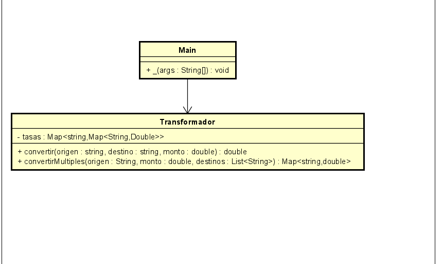

# Laboratorio 2 - CVDS (DOSW) punto 4

## Patrón de Diseño

### Patrón Utilizado: **Strategy**

### Justificación
El patrón Strategy permite encapsular algoritmos en clases separadas y hacerlos intercambiables sin modificar el cliente.  
En este caso, la lógica de conversión de divisas está centralizada en la clase `Transformar`, que actúa como estrategia de conversión.  
Esto evita el uso de múltiples estructuras condicionales para cada posible par de monedas, lo que hace el código más claro, mantenible y abierto a extensiones (nuevas monedas o reglas).

### Cómo lo apliqué
- La clase `Transformar` define el comportamiento de conversión (`convertir` y `convertirAMultiples`).
- El cliente (`Main`) delega el cálculo a esta clase sin importar cómo se realiza la conversión.
- Si en el futuro se quiere añadir un nuevo método de conversión (por ejemplo, usando tasas de una API externa en tiempo real), se puede implementar otra estrategia sin modificar el flujo principal del programa.

