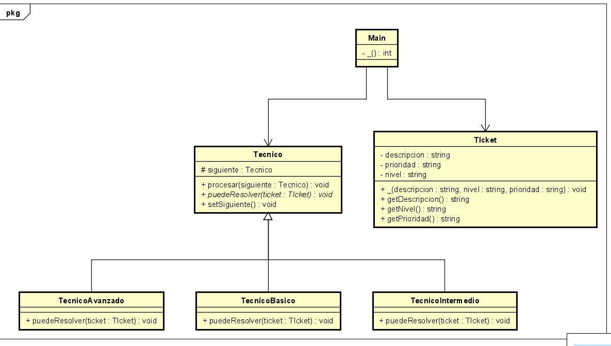

# Laboratorio 2 - CVDS (DOSW) problema 6

## Patrón de Diseño:

→ Chain of Responsibility (Cadena de Responsabilidad)
Cada técnico maneja un ticket o lo pasa al siguiente.

## Justificación:

Este patrón desacopla el emisor del receptor. El cliente no sabe qué técnico resolverá el ticket.

## Streams:

Se usan para contar tickets por nivel o generar estadísticas.

